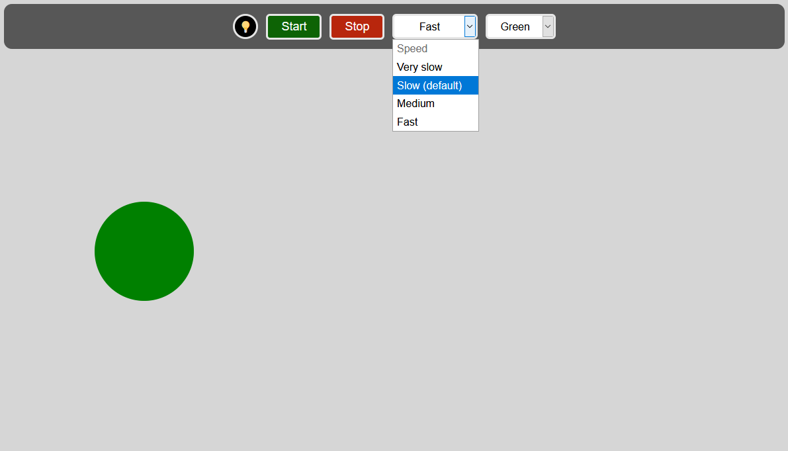

# EMDR
###### Customisable tool for EMDR therapy

After reading online about a therapy technique known as 'EMDR' [(Eye Movement Desensitization and Reprocessing)](https://en.wikipedia.org/wiki/Eye_movement_desensitization_and_reprocessing), I wanted to see if I could build a tool to replicate one of the physical tools used in real-life treatment sessions.

The theory is that by having a patient use their eyes to follow the pendular movement of a shape or light source, it can be useful in treating conditions such as PTSD (if used simultaneously with discussion-based therapy, and only by a trained professional).

**There is no consensus on the efficacy of such a therapy, and this tool was not designed to be anything other than a learning exercise.**

## Possible Improvements:
- Customisable shapes and more predefined colors.
- Responsive design. (Currently does not yet work on smaller screen sizes).
- Session timer.
- Disclosure and links to further reading on the subject matter.